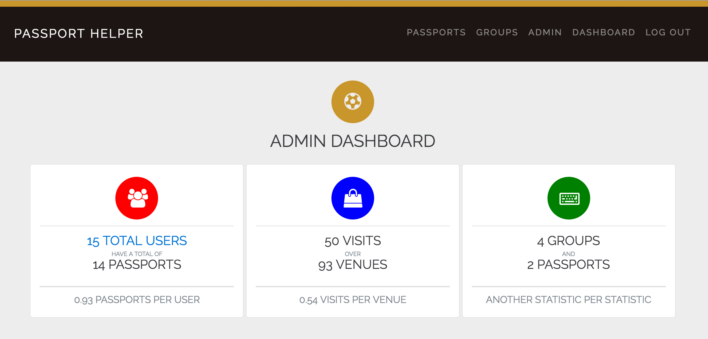

# Passport Helper


This is an app that creates a social component initially inspired by [The Passport Program](http://thepassportprogram.com/denver). The passport is a book with 2-for-1 deals on alcoholic beverages at various venues around the city. The passport helper allows you to create friend groups that also have the passport, it will keep track of venues visited. It will allow you to create events based on neighborhood and the number of venues.

```
git clone git@github.com:notmarkmiranda/passport-helper.git
cd passport-helper
bundle
rake db:create db:migrate all db:seed
```

Live Version: http://passport-helper.herokuapp.com

The seed file will create 10 empty groups. There is admin functionality to be able to see sitewide stats.


